- [Using the Embroidery Machine](#using-the-Embroidery-Machine)
  * [Turning on the Machine](#turning-on-the-machine)
  * [Preparing the Machine for Embroidery](#preparing-the-machine-for-embroidery)
    + [Changing the Needle](#changing-the-needle)
    + [Changing the Foot](#changing-the-foot)
    + [Changing the Unit](#changing-the-unit)
  * [Preparing to Embroider](#preparing-to-embroider)
    + [Preparing the bobbin](#preparing-the-bobbin)
      - [Refilling a Bobbin](#refilling-a-bobbin)
        * [Winding the Bobbin Horizontally](#winding-the-bobbin-horizontally)
        * [Winding the Bobbin from the Needle](#winding-the-bobbin-from-the-needle)
      - [Loading the Bobbin](#loading-the-bobbin)
    + [Getting the Hoop Ready](#getting-the-hoop-ready)      
      - [Hoop Overview](#hoop-overview)      
      - [Preparing the Hoop](#preparing-the-hoop)      
      - [Attaching and Removing the Hoop)(#attaching-and-removing-the-hoop)
  * [Machine Basics](#machine-basics)      
    + [Raising/Lowering the Presser Foot](#raisinglowering-the-presser-foot)
    + [Raising/Lowering the Needle](#raisinglowering-the-presser-foot) 
    
# Using the Embroidery Machine

*illustrations grabbed from machine [manual](Manual.pdf)*

## Turning on the Machine

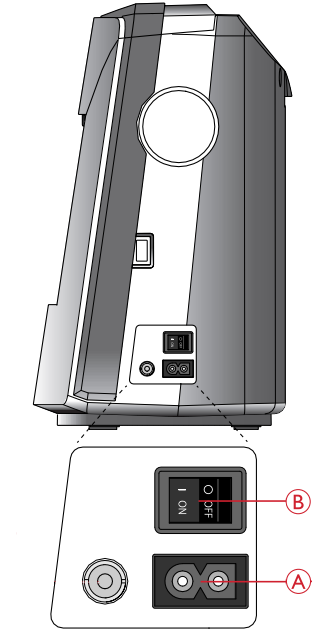

Plug the power cord into the power socket (A), located on the right side of the machine. Once it's plugged in, you can turn the machine on using the power switch (B) 

## Preparing the Machine for Embroidery

In this section, we will go over how to prepare the machine for embroidery. You will want to do this with the machine *off*. This will require us to attach the embroidery unit, and the embroidery foot, and optionally an embroidery needle.

### Changing the Needle
*make sure the machine is off*

You will need to change the needle if the needle is broken, or if you need to switch between an embroidery needle and sewing needle. Note that both work in embroidery mode, but the embroidery needle is less prone to fraying or breaking the thread.

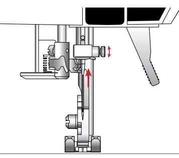

Loosen the needle screw with the screwdriver, this will allow you to pull the needle out through the bottom. Once it's out, you can insert the new needle upwards with the flat side away from you. Push it all the way up, and then tighten the needle screw with the screwdriver

### Changing the foot
*make sure the machine is off*

With the power off, remove the current foot.

### Changing the Unit
*make sure the machine is off*

#### Overview
This is the embroidery unit, it holds the embroidery hoop in place and allows the machine to move the hoop in the x and y directions.

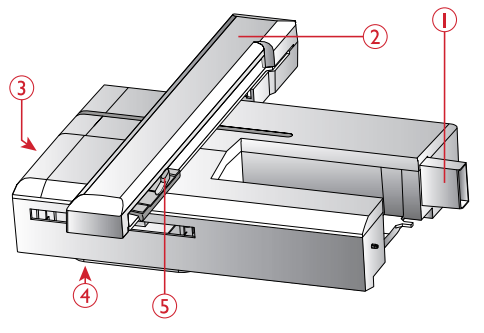
1. Embroidery unit plug
2. Embroidery arm
3. Embroidery unit release button (underside)
4. Level adjusting feet
5. Embroidery hoop attachment

#### Removing a Unit
If there is a different unit currently attached to the machine, you will want to remove it by sliding it out.

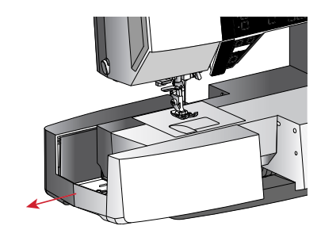

remove the sewing unit (or other unit) by sliding it left.

#### Attaching the Embrodiery Unit
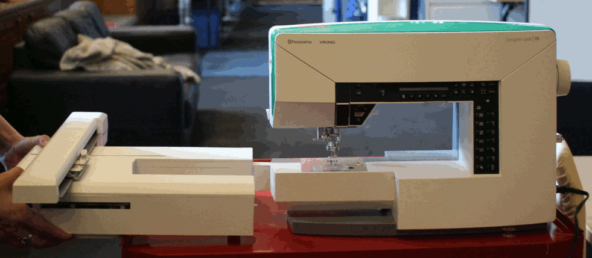

Attach the embroidry unit by sliding it into location - it will snap into place.

## Preparing to Embroider

### Preparing the Bobbin

#### Refilling a Bobbin

##### Winding the Bobbin Horizontally

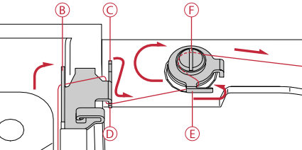

1. Place the felt pad and thread spool on the spool pin in horizontal position. Slide on a spool cap of the right type and direction.

2. Place the thread under the thread guide (A) from right to left. Pull the thread to the rear and around the thread guide (B) from left to right, then around thread guide (C) and into the notch (D).

3. Pull thread to the right and then through the thread guide (E) from front to back. Pass thread under tension disc (F) in clockwise direction. 
Note: Make sure the thread is pulled securely inside the tension disc
for correct thread tension.

4. Thread through the hole in the empty bobbin (G) from the inside to the outside.

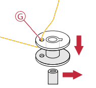

5. Place the bobbin on the bobbin winder spindle. 

6. Push the bobbin spindle to the right to wind. A pop-up appears on the screen to inform you that bobbin winding is active. Press the start/stop button to start winding the bobbin. Hold the end of the thread firmly when starting to wind. When the bobbin is full, press the start/stop button again to stop. Push the bobbin spindle to the left. The pop-up closes. Remove the 
bobbin and cut the thread using the bobbin thread cutter
(H).

*Note: When winding the bobbin from auxiliary spool pin, do not hook
thread to the guide (C) and notch (D).*

##### Winding the Bobbin from the Needle
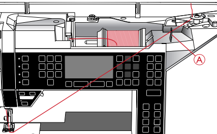

Make sure the presser foot is raised and the needle is in its
highest position.
Note: Use a metal presser foot when bobbin winding from the needle. Pull the thread from the needle under the presser foot and to the right through the thread guide (A).

#### Loading the Bobbin

*Make sure the needle is fully raised and the machine is turned off before inserting or removing the bobbin.*

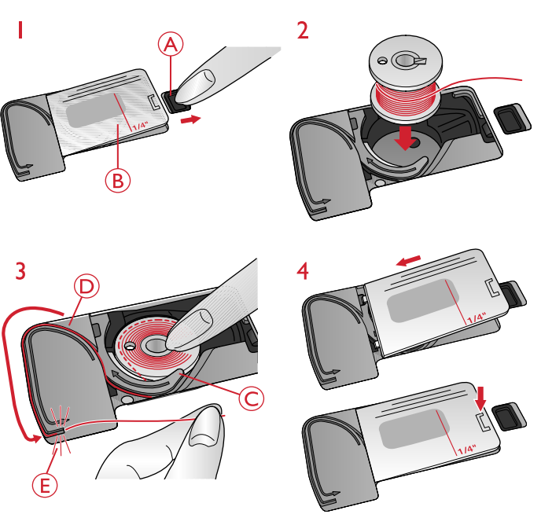

1. Open the bobbin cover by pushing the release button to the right (A). Remove the cover (B). 
2. Insert the bobbin in the bobbin case with the thread running in a counterclockwise direction. 
3. With a finger held gently on top of the bobbin, pull the thread into notch (C). Then pull the thread at arrow
markings into the needle plate thread guide from (C) to (D). Pull the thread at the arrow markings into the needle
plate thread guide from (D) to (E). To cut off excess thread, pull thread to the right, over the blade (E).
4. Replace the bobbin cover

### Getting the Hoop Ready

#### Hoop Overview

Hoop Overview
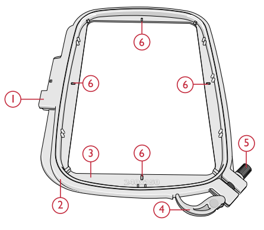
1. Embroidery hoop connector
2. Outer hoop
3. Inner hoop
4. Quick release
5. Retaining screw
6. Center marks

#### Preparing the Hoop

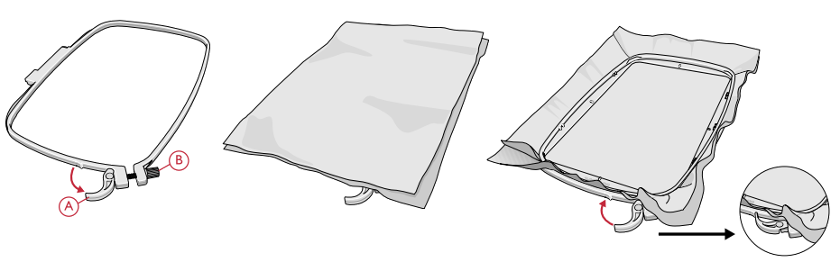

To put the fabric into the hoop, place the outer hoop on the table,open the quick release (A) and loosen the screw (B). Put the fabric backing and fabric on top of the hoop, with the fabric on the topmost. Then, place the inner hoop on top of the fabric, and press it firmly into the outer hoop. Close the quick release, and turn the screw until the fabric is secured firmly. The fabric should be taut for best results.

#### Attaching and Removing the Hoop 

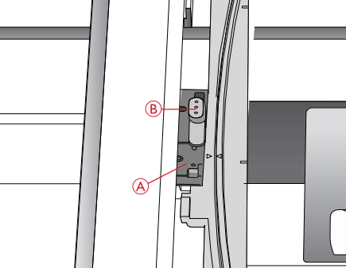

Slide the hoop connector into the hoop attachment (A), it will click into place. You will need to raise the presser foot past the raised position to make sure the hoop can fit underneath. To remove the hoop from the embroidery arm, press the grey button (B) on the hoop attachment and slide the hoop towards you.

## Machine Basics 

### Raising/Lowering the Presser Foot

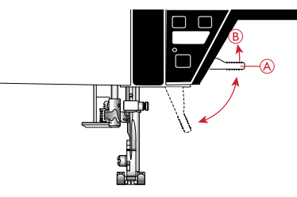

The presser foot is lowered or raised with the presser foot lift, it is raised when lifted up (A), and lowered when pushed down (B) . The presser foot can be raised higher (C) to make it
easier to slide the the embroidery hoop into location.

### Raising/Lowering the Needle

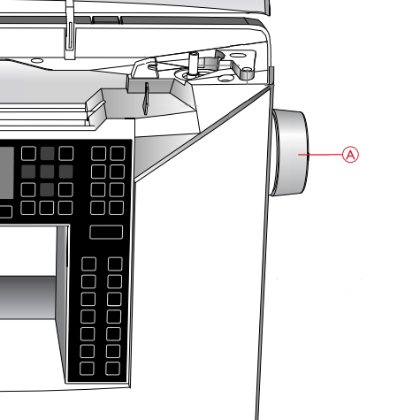

Turn the Handwheel (A) to raise or lower the needle manually.
